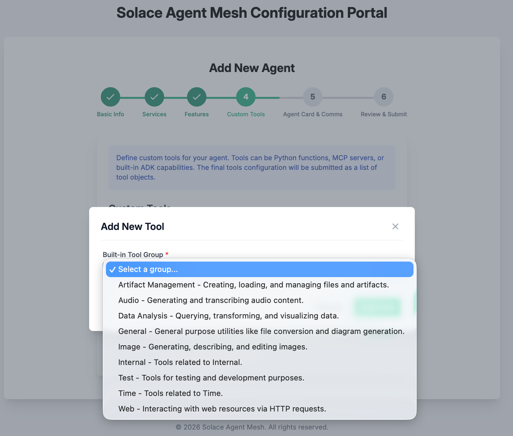

# 🌐 Welcome to the Solace Agent Mesh Workshop

---

##### 
##### <center>Before you proceed, STAR the Solace Agent Mesh GitHub Repository! </center>
##### <center>Take a moment to visit:</center>
##### <center>https://github.com/SolaceLabs/solace-agent-mesh/</center>
##### <center>And, hit that STAR button :)</center>
##### 

---
> **Before You Begin:**  
> You’ll need a GitHub account to participate in this workshop.  
> Don’t have one yet? Follow these quick steps:  
> - Visit [GitHub](https://github.com/)  
> - Click **Sign up** or **Continue with Google**  
> - Follow the prompts to complete setup

This guide walks you through setting up **GitHub Codespaces** and installing **Solace Agent Mesh (SAM)** for the workshop.

---

## 🧩 1. Setup GitHub Codespace

### Step 1: **Open the Workshop Repository**  
   Visit [Solace Developer Workshops](https://github.com/SolaceDev/solace-developer-workshops/)  
   

### Step 2: Click **Open in GitHub Codespaces**  
   

### Step 3: Choose **Change Options** → set machine type to **4-core**  
   

### Step 4: Click **Create Codespace**  
   Once it’s ready, you’ll see Visual Studio Code running in your browser — your personal VM workspace.  
   

---

## ⚙️ 2. Install Solace Agent Mesh (SAM)

### Step 1: Install SAM CLI
In the terminal, run the following commands.
```
mkdir sam-bootcamp
cd sam-bootcamp
```

### Step 2: Setup Python virtual environment
```
python3.12 -m venv venv
```

### Step 3: Activate virtual environment
```
source venv/bin/activate
```

### Step 4: Install solace agent mesh
```
pip install solace-agent-mesh
```

### Step 5: Verify sam installation
```
sam -v
```
You should see the installed sam version information.

---

## 🚀 3. Initialize Solace Agent Mesh

### Step 1: Initialize SAM
In the `/workspaces/solace-developer-workshops/sam-bootcamp` directory, run the following


```
sam init --gui
```

This opens a browser portal — click **Open in Browser** (or use Cmd/Ctrl + Click on the link in the log, e.g., `http://127.0.0.1:8000`).  


In the opened web page, configure SAM.


1. From here, choose "Advanced Setup" to spin up an instance of the Agent Mesh that uses the Solace Broker as the communication backbone.

> Note that the simple setup "Getting Started Quickly" spins up Agent Mesh without the Solace Broker and uses in-memory queues instead. This is not meant for production ready development and proof of concept project that require high performance and multiple Agentic workflow interactions.

2. Choose a namespace for your project


> The namespace will act as the topic root for all events in SAM

3. Configure connection to the Solace Broker

- Log in to your **Solace Cloud Console**  
- Navigate to **Cluster Manager → Connect**  
  
- Keep **Broker Type** as *Existing Solace Pub/Sub+ Broker*  
- Copy connection details into the **Broker Setup** screen  
  

4. Configure your LLM endpoint, API Key, and Model name
> The model of choice impacts the performance of your results and system behavior. A performant model is recommended for advanced use-cases

- Choose **OpenAI Compatible Provider**
- Set **LLM Endpoint URL** to `https://lite-llm.mymaas.net`
- Enter the **LLM API Key** shared during the workshop
- Select **bedrock-anthropic-claude-3-5-sonnet** from the model dropdown  
  

5. Configure the orchestrator agent


> Keep all the configuration parameters as default. You can explore the other options for configuring the orchestrator agent to see what you have available for fine tuning the behavior

6. Configure the WebUI Gateway

> Note: Choose any Session Secret Key needed for the WebUI. Keep the remaining configurations as default.

>If you are running a local broker on a docker container with SAM Enterprise in a docker container as well, we will configure this in the following steps

7. After initialization completes, you’ll see confirmation in your Codespaces terminal:  


The sam-bootcamp folder will have the basic structure created, and you are all set to go.
 
 

---

## ▶️ 4. Start Solace Agent Mesh

1. Check installation:
   ```bash
   sam -v
   ```

2. Start SAM:
   ```bash
   sam run
   ```

You’ll see logs as the system starts:  


> ⚠️ **Note:** When prompted to open a port (8080), wait until logs stabilize, then open the browser view or use the URL `http://127.0.0.1:8000`.

Your Solace Agent Mesh Chat interface will now appear:  
  


---

## 🤖 5. Explore Agents

Now, let’s interact with SAM.

Enter in the chat area:
```
What agents do you have access to and what are their capabilities?
```


You can visualize agent interactions (e.g., **Orchestrator ↔ LLM**) by clicking the **network** icon below any chat response.

> 💬 As you install more agents, you can always ask SAM for a list of available agents and capabilities.

---

## ▶️ 6. Install Built-in Tools (Agents)

While Solace Agent Mesh is running in the current terminal, open a **new terminal** and launch the plugin catalog to add new agents.


Solace Agent Mesh comes with a set of built-in tools. Built-in tools are pre-packaged functionalities that can be granted to agents without requiring custom Python code. These tools address common operations such as file management, data analysis, web requests, and multi-modal generation.

### Steps

1. In the terminal, navigate to your SAM workspace and activate the environment:
   ```bash
   cd sam-bootcamp
   source venv/bin/activate
   ```

2. Run the following command to add a new agent:
   ```bash
   sam add agent --gui
   ```
> **NOTE**: The opened page might show the SAM installation GUI - just add the URI element `?config_mode=addAgent` to the end of the URL. 
For example: The opened page URL `https://glorious-bassoon-j79qgqjxgrh996-5002.app.github.dev/`, change it to `https://glorious-bassoon-j79qgqjxgrh996-5002.app.github.dev/?config_mode=addAgent`

- Name the agent as `Builtin Tools` and click on `Next`

- Use the default setting and click on `Next`

- Use the default setting and click on `Next`

- Click on `+ Add Tool` button and add the following tools

- Review the list of tools available for use

- Select the following tools and add
  + Data Analysis
  + General
  + Internal
  + Web
Click on `Next`

- Leave default settings and click on `Next`

- Review the agent summary configuration and click on `Save Agent & Finish`

- Let us review the Agents. In the SAM browser tab, click on `Agents` to see the newly added agent.


>**NOTE:** The newly added agent needs to be started. Either you can stop the `sam run` process with `Ctrl+C` and launch `sam run`, which will start all the agents.
Alternatively, you can launch the agents independently - open a new terminal and pass the agent configuration YAML files as arguments to the `sam run` command.
> - Open a new terminal
> - Activate the environment 
      `cd sam-bootcamp`
      `source venv/bin/activate`
> - Launch the agents
      `sam run config/agents/sam_geo_information.yaml config/agents/sam_mermaid.yaml config/agents/find_my_ip.yaml`

2. Let us test the use of these agents. In the Chat, enter a simple query
   ```bash
   What agents do you have access to and what are their capabilities?
   ```

> **HINT:** If the workflow panel is not visible, just click on the network image !at the bottom of the chat panel (left) 
 

3. Let us issue a query that makes use of the built-in tools.
   ```bash
   Summarize the capabilities of the agent with sample queries as a HTML report
   ```
You will see an HTML report listing agentic capabilities available.
 

---

## ▶️ 7. Install Agents (Contributed)

While Solace Agent Mesh is running in the current terminal, open a **new terminal** and launch the plugin catalog to add new agents.


Solace provides a set of reusable, open-source agents. SAM makes it easy to install agents from these repositories with just a few clicks.

- **SolaceLabs Core Plugins:**  
  https://github.com/SolaceLabs/solace-agent-mesh-core-plugins  
- **SolaceCommunity Plugins:**  
  https://github.com/solacecommunity/solace-agent-mesh-plugins  

> **Note:** The SolaceCommunity repository is open source and contains community-contributed agents — we encourage contributions!

### Steps

1. In the terminal, navigate to your SAM workspace and activate the environment:
   ```bash
   cd sam-bootcamp
   source venv/bin/activate
   ```

2. Launch the plugin catalog:
   ```bash
   sam plugin catalog
   ```

   This opens the catalog portal in your browser (typically `http://127.0.0.1:5003/?config_mode=pluginCatalog`).  
   
> **NOTE**: The opened page might show the SAM installation GUI - just add the URI element `?config_mode=pluginCatalog` to the end of the URL. 
For example: The opened page URL `https://glorious-bassoon-j79qgqjxgrh996-5002.app.github.dev/`, change it to `https://glorious-bassoon-j79qgqjxgrh996-5002.app.github.dev/?config_mode=pluginCatalog`


3. Review available agents and their capabilities by clicking **More** on each tile.

4. Add the following registries:  
   - **SolaceLabs Repository:**  
     - URL: `https://github.com/SolaceLabs/solace-agent-mesh-core-plugins`  
     - Name: `SolaceLabs`
   - **SolaceCommunity Repository:**  
     - URL: `https://github.com/solacecommunity/solace-agent-mesh-plugins`  
     - Name: `SolaceCommunity`

5. Click **Refresh** to load all available agents.

6. Install these example agents:  
   - `sam_geo_information`  
   - `sam_mermaid`  
   - `find_my_ip`  

> **HINT:** Use the same name as the plugin for the agent name.

>**NOTE:** When done, you can close the SAM catalog tab and stop the process with `Ctrl+C` and launch `sam run`, which will start all the agents.
Alternatively, you can launch the agents independently - open a new terminal and pass the agent configuration YAML files as arguments to the `sam run` command.
> - Open a new terminal
> - Activate the environment 
      `cd sam-bootcamp`
      `source venv/bin/activate`
> - Launch the agents
      `sam run config/agents/sam_geo_information.yaml config/agents/sam_mermaid.yaml config/agents/find_my_ip.yaml`


---

## ▶️ 8. Review the Registered Agents

In the SAM Chat console, click the **Agents** tool on the left sidebar. You should now see the newly registered agents alongside the **Orchestrator** agent.  


Click **Click for details** on any agent card to learn more about its configuration and skills.

Now, let’s interact again with SAM:

```
What agents do you have access to and what are their capabilities?
```


You can visualize agent interactions (e.g., **Orchestrator ↔ LLM**) by clicking the **network** icon below any chat response.

---

## ▶️ 9. Try Sample Queries

Try these sample prompts in your SAM chat:

```
What is the weather around me today?
```

```
Create a bar chart showing the population of the five largest cities in Australia.
```

Or something fun:

```
Create a simple flowchart showing the steps to make a cup of tea.
```

The more diverse the agents, the richer your conversational analytics experience — all powered by **Solace Event Mesh**.

Yes, we’ll discuss the role of Event Mesh in Solace Agent Mesh during the session.

---

## 🔗 10. Connect External Agents with A2A Proxy

Solace Agent Mesh supports **Agent-to-Agent (A2A) proxies** to integrate external agentic frameworks like AWS Bedrock Agents, Azure AI Agent Service, or custom REST-based agents into your mesh.

### What is an A2A Proxy?

An A2A proxy acts as a bridge between SAM and external agent frameworks. Instead of rewriting agents in Python, you can expose existing agents through SAM's event-driven architecture.

**Use cases:**
- Connect enterprise agents built on AWS, Azure, or Google platforms
- Integrate legacy AI services without code rewrites
- Enable cross-platform agent collaboration

### Steps to Add Your First A2A Agent

1. In a new terminal, navigate to your SAM workspace:
   ```bash
   cd sam-bootcamp
   source venv/bin/activate
   ```

2. Create a proxy configuration:
   ```bash
   sam add agent --gui
   ```

3. In the agent setup wizard:
   - **Name:** `AWS Travel Assistant`
   - **Agent Type:** Select **A2A Proxy**
   - **Endpoint URL:** `<Your-AWS-Bedrock-Agent-Endpoint>` (provided during workshop)
   - **Authentication:** Configure API key/credentials as needed
   - **Description:** `Travel planning and recommendations agent`

4. Save and restart agents:
   ```bash
   sam run
   ```

### Try It Out

In the SAM chat, ask:
```
Plan a 3-day trip to Tokyo with must-see attractions
```

The orchestrator will route the request to your AWS Travel Assistant via the A2A proxy!

> 📖 **Learn more:** [SAM Proxy Documentation](https://solacelabs.github.io/solace-agent-mesh/docs/documentation/components/proxies)

---

## 🌟 11. Add More A2A Agents

Now that you've connected one external agent, let's add more for richer interactions.

### Available Pre-Hosted Agents

During the workshop, you have access to these pre-hosted agents:

1. **Azure Recipe Generator** (Azure AI Agent Service)
   - Endpoint: `<Azure-Endpoint>` (provided during workshop)
   - Capability: Creates recipes based on ingredients and dietary preferences

2. **Google Code Reviewer** (Custom REST Agent)
   - Endpoint: `<Google-Endpoint>` (provided during workshop)
   - Capability: Reviews code snippets and suggests improvements

### Quick Setup

For each agent, repeat the proxy setup:

```bash
sam add agent --gui
```

Configure each with:
- Unique name (e.g., `Recipe Generator`, `Code Reviewer`)
- Agent Type: **A2A Proxy**
- Endpoint URL and credentials (provided)
- Clear description of capabilities

### Manual Configuration (No GUI)

Prefer working with config files? Create a YAML file in `config/agents/`:

**Example: `config/agents/recipe_generator.yaml`**
```yaml
name: Recipe Generator
component_type: a2a_proxy
component_config:
  endpoint_url: https://your-azure-endpoint.azurewebsites.net/api/invoke
  authentication:
    type: api_key
    api_key: ${AZURE_API_KEY}
  description: Creates recipes based on ingredients and dietary preferences
  input_schema:
    type: object
    properties:
      query:
        type: string
        description: User's recipe request with ingredients
  output_schema:
    type: object
    properties:
      response:
        type: string
        description: Generated recipe with instructions
```

Then run:
```bash
sam run config/agents/recipe_generator.yaml
```

> 💡 **Tip:** Use environment variables for sensitive credentials like `${AZURE_API_KEY}` instead of hardcoding them

### Example Interactions

**Recipe Generator:**
```
I have chicken, tomatoes, and basil. What can I make?
```

**Code Reviewer:**
```
Review this Python function for best practices:
def calc(x,y):
    return x+y
```

### Fun Agent Ideas to Build

Want to host your own? Consider building:
- **Fitness Coach:** Workout plans and nutrition advice
- **Meeting Summarizer:** Digest meeting notes and action items
- **Bug Bounty Hunter:** Analyzes code for security vulnerabilities
- **Dad Joke Generator:** Because every mesh needs humor 😄

> 💡 **Tip:** Deploy agents using AWS Lambda, Azure Functions, or simple Flask APIs

---

## 🚀 12. Bring Your Own Agents

Ready to integrate your organization's agents? SAM supports any framework with a REST/HTTP interface.

### Supported Frameworks

- **AWS Bedrock Agents** (Action Groups, Knowledge Bases)
- **Azure AI Agent Service** (Copilot Studio, Azure OpenAI Assistants)
- **Google Vertex AI Agents**
- **LangChain/LangGraph agents** (via REST wrapper)
- **Semantic Kernel agents**
- **Custom REST APIs**

### Integration Steps

1. **Expose your agent** via HTTP endpoint (GET/POST)
2. **Document the schema** (input/output format)
3. **Add to SAM** using `sam add agent --gui` → A2A Proxy
4. **Test connectivity** before deploying to production

### Example: Custom LangChain Agent

If you have a LangChain agent, wrap it with FastAPI:

```python
from fastapi import FastAPI
from langchain import Agent

app = FastAPI()

@app.post("/invoke")
async def invoke_agent(query: str):
    result = my_langchain_agent.run(query)
    return {"response": result}
```

Then add to SAM with endpoint: `https://your-domain.com/invoke`

### 🎯 Challenge

Before the workshop ends:
1. Connect at least **2 A2A agents** to your SAM instance
2. Create a **multi-agent workflow** (e.g., "Plan a trip, then create recipes for the destination")
3. Share your coolest agent interaction in the workshop chat!

> 🔧 **Need help?** Ask in [Solace Community](https://community.solace.com/c/solace-agent-mesh/16) or during the workshop Q&A.

---

### ✅ That's It!
You’ve successfully:  
- Set up GitHub Codespaces  
- Installed and initialized Solace Agent Mesh  
- Started your own SAM instance  
- Explored and installed agents  

> 🧠 Next step: Try deploying additional agents and experiment with **Agent-to-Agent (A2A)** communication.

---
##### 
##### <center>If you have not STARRED already, take a moment to visit:</center>
##### <center>https://github.com/SolaceLabs/solace-agent-mesh/</center>
##### <center>And, hit that STAR button :)</center>
##### 


---

### 📚 Additional Resources

- [Solace Agent Mesh GitHub Repository](https://github.com/SolaceLabs/solace-agent-mesh)  
- [Official Solace Agent Mesh Documentation](https://docs.solace.dev/agent-mesh/)  
- [Solace Developer Portal](https://solace.dev)  

---

**For questions or troubleshooting:**  
Ask during the workshop or visit [Solace Agent Mesh Documentation](https://solacelabs.github.io/solace-agent-mesh/docs/documentation/getting-started/introduction/) or ask in [Solace Community](https://community.solace.com/c/solace-agent-mesh/16).

---

*© 2025 Solace Developer Workshops — For educational use only.*

